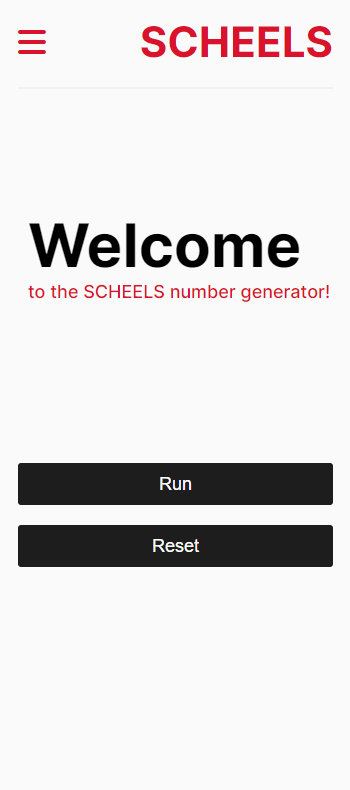

# scheels-numbers

## Link to Site

[Github Pages Site](https://eaakre.github.io/scheels-numbers/)

## About

This program will print every number from the minimum to the maximum set numbers. Each number divisible by 3 will be replaced by the company name. Each number divisible by 5 will be replaced by the extension. The default settings are as follows:

- Minimum: 1
- Maximum: 100
- Company: SCHEELS
- Extension: .COM

These settings may be changed by clicking on the settings button.

## Responsiveness

This program is set up to be mobile responsive.

## Desktop Screenshot

## Mobile Screenshot

